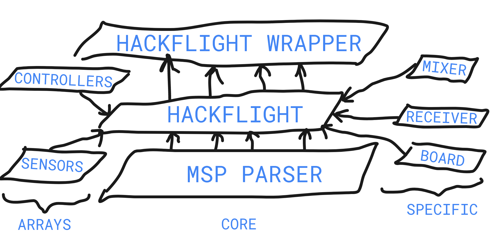

# Documentation
Different bits of documentation to ease BonaDrone's developers life

## EEPROM Usage

### EEPROM Parameters

The first 100 EEPROM slots are reserved for storing Mosquito parameters. The full list of parameters as well as its EEPROM addresses is listed below.

| Address |   Parameter Name  |                           Description                           | MSP Message ID |
|:-------:|:-----------------:|:---------------------------------------------------------------:|:--------------:|
|    0    |  MOSQUITO_VERSION |      Sets the version of the Mosquito (1 if 90, 0 if 1500)      |       223      |
|    1    | POSITIONING_BOARD | Specifies if positioning board is present (1 it is, 0 it isn't) |       225      |
|         |                   |                                                                 |                |
|         |                   |                                                                 |                |
|         |                   |                                                                 |                |
|         |                   |                                                                 |                |
|         |                   |                                                                 |                |
|         |                   |                                                                 |                |
|         |                   |                                                                 |                |

### EEPROM Mission storage

When programming a mission, the navigation related data is stored in the EEPROM from address 100 until the end.

## Battery Check
For BonaDrone's FC, the battery check can be performed by reading the value of the ESP32's pin 33.


## Autogenerate MSP commands Hackflight

Each time the `messages.json` file is modified the following commands should be executed for the changes to take effect:
* `cd` into `Hackflight/extras/parser`
* `$ python3 msppg.py`
* `$ cd output/python/`
* `$ sudo python3 setup.py install`

When adding a new MSP message to `messages.json` it should be taken into account that, due to the current implementation of [msppg.py](https://github.com/BonaDrone/Hackflight/blob/master/extras/parser/msppg.py), messages with ID codes lower than 200 are used to request data from Hackflight whereas messages with ID code equal or higher than 200 are used to receive data.  

If you would like to add some additional lines of code to `mspparser.hpp` and avoid them disappearing when running `msppg.py` be sure to add them to `Hackflight/extras/parser/resources/mspparser.hpp`  

## ESP32 

### Requirements

Follow the [official instructions](https://github.com/espressif/arduino-esp32/blob/master/docs/arduino-ide/boards_manager.md) to get the ESP32 drivers on your Arduino IDE.

Make sure you have first uploaded the `ESP32_flash_loader.ino` under the `extras` folder into the board.

### Start ESP32 in boot mode

**Note**: The [ESP flash loader](https://github.com/BonaDrone/ESP32-Sketchs/blob/master/extras/ESP32_flash_loader/ESP32_flash_loader.ino) code does already force the ESP32 to enter boot mode, so the following 3 steps are not longer required.

* Remove power from board
* Connect ESP32 GPIO 0 pin to ground
* With the previous connection done, power the board

### Arduino settings to program the ESP32

* Upload Speed: 115200
* Flash Frequency: 80 MHz
* Flash Mode: DIO
* Flash Size: 4MB (32 Mb)
* Partition Scheme: Default
* Core Debug Level: None
* PSRAM: Disabled


## IMU biases

**Note**: When the board is powered and initialized it automatically computes and loads Accel and Gyro biases so it is no longer requried to know this values and substitute them in the code.

```C
// Biases
float ACCEL_BIAS[3] = {-0.014827,-0.000640,0.036611};
float GYRO_BIAS[3]  = {0.837052,-1.535432,-3.138039};
```

## Juan transmitter trims

```C
// Trim receiver via software
rc.setTrimRoll(-0.0030506f);
rc.setTrimPitch(-0.0372178f);
rc.setTrimYaw(-0.0384381f);
```

## Control loop

### Current
**Rate PID**


**Level PID**


**AltHold PID**

Based on [iNav's AltHold PID](https://github.com/iNavFlight/inav/wiki/Developer-info)

### Old


### Original


## Hackflight Architecture

